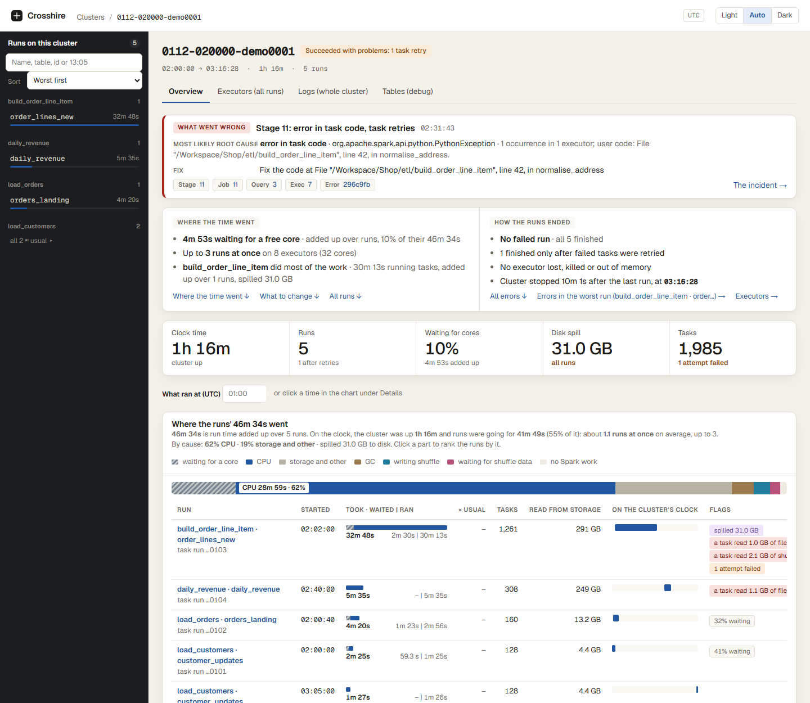
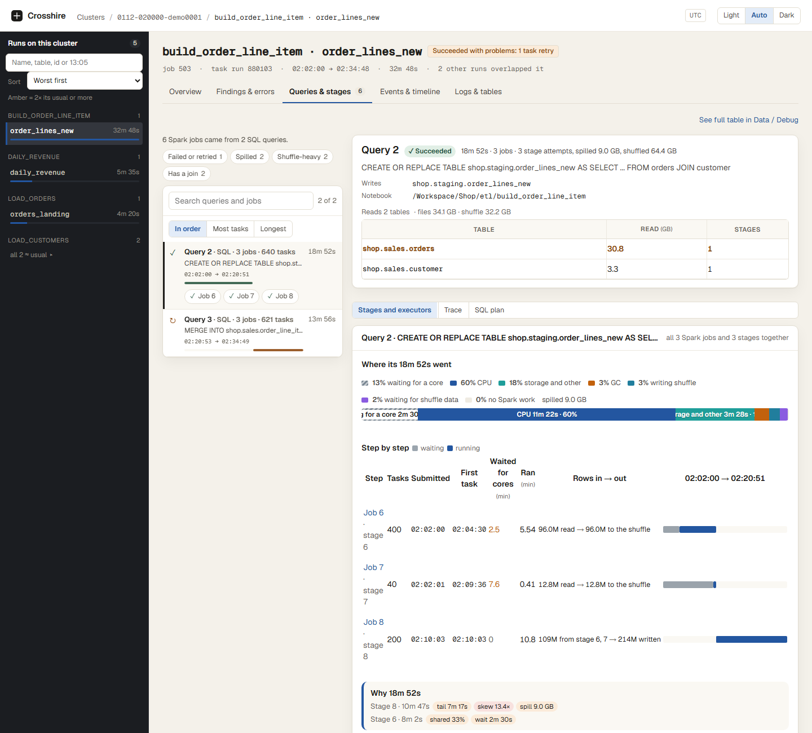

# Databricks Cluster Log Analyzer

> **Not a perfect tool, but a fast one, and it helps every time.** In most cases (90% to 99%, depending on the
> problem) it names the real issue on its own, in minutes and with little effort from you. When it can't, it still
> gives you enough data to work it out yourself: its findings help you **rule things out** and show you **where to dive
> in**. So it helps with the analysis 100% of the time. You know where to look and what to fix in minutes, not hours,
> and you can trust what you find.

Point it at the logs Databricks delivers for a cluster (driver and executor logs, Spark event logs). It turns them into
Parquet datasets and opens a **local web UI** that answers:

- **Where did the time go?** How long the cluster was up next to the run time added up over all runs, how much of it
  was spent queued on a full cluster (every core busy), and each run's time split by cause.
- **What failed, and why?** Failed jobs and queries, task retries that still succeeded, lost or out-of-memory
  executors, and errors grouped with the first line of your own code.
- **What should I change?** Grouped fixes, highest impact first, each with what the data shows, the likely cause and
  the setting or code change. For the whole cluster and for each run.
- **Which tables cost the most?** Size, files, file size (average, smallest and largest), rows per file, files
  skipped, bytes and rows pulled, and scan time, for the cluster, a run or one query. It flags files over 1 GiB (on
  average or the largest one), big tables read whole, and tables scanned again and again.
- **Where did the rows go?** Rows read and written per table, rows in and out of every stage (per parent stage), and
  rows passed from one query or Spark job to the next. It flags a join that puts out more rows than came in.
- **Which stage or task is to blame?** Drill down from cluster to run, query, Spark job, stage and task, with skew,
  spill, shuffle, GC and executor charts.
- **Are the logs complete?** When event-log files, executor logs or GC lines are missing, a Coverage line under the
  title says what is missing and which numbers that leaves partial.

Everything runs on your laptop: no Spark, no cluster, nothing leaves the machine.

A cluster has its own tabs: **Overview, Findings, Errors, Executors, Logs and Raw data**, all for the whole cluster
(Findings and Errors list every run's problems, each with a chip naming its run). Pick a run and you get the run's
tabs: Overview, Findings & errors, Queries & stages, Events & timeline, Executors and Logs & raw data. Sizes are
binary everywhere (KiB, MiB, GiB).

| Cluster overview | A query: step by step, rows in → out |
|---|---|
|  |  |

**For the full tour, with every screen explained, open [README.html](README.html)** in a browser: clone or download
the repo and double-click it, or view it online through
[htmlpreview](https://htmlpreview.github.io/?https://github.com/darshanmeel/databricks-log-analyzer/blob/main/README.html).

## Install and run

You need only **Python 3.11+**. The web UI is already built and ships in the package, so you don't need Node.js.

**Windows (PowerShell)**

```powershell
git clone https://github.com/darshanmeel/databricks-log-analyzer.git   # or unzip the download
cd databricks-log-analyzer
python -m pip install -e .
dbx-log-analyzer ui --output C:\dbx\output --cache C:\dbx\cache
```

**macOS / Linux**

```bash
git clone https://github.com/darshanmeel/databricks-log-analyzer.git
cd databricks-log-analyzer
python3 -m pip install -e .
dbx-log-analyzer ui --output ~/dbx/output --cache ~/dbx/cache
```

A browser tab opens at http://127.0.0.1:8765. On **Home**:

1. Pick **Local folder** (or a Unity Catalog volume, ADLS or S3).
2. Enter the folder that *contains* the cluster-id folder.
3. Pick the cluster and click **Analyze**.

Every analyzed cluster has an **Analyze again** button. It rebuilds the analysis from the same raw logs with the
newest version of the tool, as long as those logs are still on disk. Outputs built before analyzer revision 20 need
it to show the newest numbers.

### Without installing the package

Install the libraries once, then point Python at `src` each time:

```powershell
python -m pip install pandas pyarrow duckdb click fastapi uvicorn   # once
$env:PYTHONPATH = "src"                                            # in every new PowerShell window
python -m databricks_cluster_log_analyzer ui --output C:\dbx\output --cache C:\dbx\cache
```

```bash
python3 -m pip install pandas pyarrow duckdb click fastapi uvicorn   # once
PYTHONPATH=src python3 -m databricks_cluster_log_analyzer ui --output ~/dbx/output --cache ~/dbx/cache
```

Cloud sources need their extra: `pip install -e ".[databricks]"` (volumes), `".[adls]"`, `".[s3]"` or `".[all]"`.

### Try it on the demo cluster

```bash
python scripts/make_demo_cluster.py ./demo_logs        # writes a synthetic cluster: 0112-020000-demo0001
dbx-log-analyzer ui --output ./demo_out --cache ./demo_cache
```

Then on Home pick **Local folder**, enter `./demo_logs` and analyze `0112-020000-demo0001`.

### Good to know

- **To update:** `git pull`, then start the UI again. Old analyses still open; click **Analyze again** for the newest
  findings.
- **"No module named databricks_cluster_log_analyzer":** run `python -m pip install -e .` in this folder, or set
  `PYTHONPATH=src`.
- **"Command not found":** use `python -m databricks_cluster_log_analyzer ui ...` instead.
- **Port in use:** add `--port 8766`.
- **Keep `--output` and `--cache` outside the repo,** so nothing from a real cluster can be committed by accident.

## Command line

```bash
dbx-log-analyzer clusters --root ./my-logs                                   # clusters in a folder (or --source volume|adls|s3)
dbx-log-analyzer analyze --root ./my-logs --cluster 0101-000000-abcd1234     # download if remote, then parse
dbx-log-analyzer build --input ./cache/0101-000000-abcd1234 [--duckdb]       # parse one local cluster folder
dbx-log-analyzer ui                                                          # the web UI
```

[README.html](README.html) covers the rest: sources and the log folder layout, every command, every dataset, the rules
file and how the tool is built.
